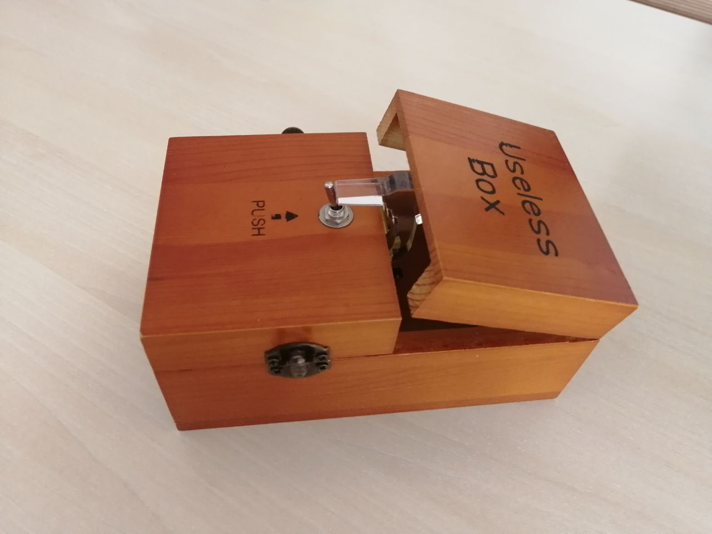

# Useless Agent

This repo contains two agents, each of which is inspired by the Useless Box.

I'd encourage you to try them one at a time, to figure out exactly how they are useless.



## Prerequisites

- Python 3.10+
- An Anthropic API key set in a `.env` file:
  ```
  ANTHROPIC_API_KEY=your_api_key_here
  ```
- Install dependencies:
  ```bash
  pip install anthropic python-dotenv rich
  ```

### Running
```bash
python agent_1/main.py
```

or

```bash
python agent_2/main.py
```

---

Type your messages and press Enter to chat. Type `exit`, `quit`, or `bye` to end the session.


